# Chompixel

**A chaotic pixel-art browser game.** Chop the field, survive zombie hordes and cowboy duels, bank
planks to wall off the swarm — then flip the *entire world* into a first-person DOOM-style raycaster
with one key. No install, no signup, runs in any browser.

### ▶ [Play now → bruno-rodriguez-mendez.com](https://bruno-rodriguez-mendez.com)

<p align="center">
  
</p>

Move with **W/A/S/D** or arrows · **space/click** to chop & attack · **1** = axe, **2** = plank ·
**F** to flip between 2D and first-person 3D.

> Secret: this world is also a portfolio. Chop open the schoolhouses and you'll find the projects
> its creator has built. Players don't need to care — it's just an easter egg. See
> [Hidden in the world](#hidden-in-the-world) below.

## Features

- **2D ⇄ 3D on one key** — a live DOOM/Wolfenstein-style raycaster rendered over the *same* running
  2D world. Zombies, planks, the cowboy, bullets, slashes and pickups all billboard in 3D too.
- **Combat sandbox** — opt-in zombie horde (A\* pathing, rare BIG zombie), opt-in cowboy duel (stalks
  in from the left, fires trailed bullets), a ranged Hollow-Knight-style slash, a gun, and a
  Terraria-Zenith-style frenzy boss every few kills.
- **Chop & build** — every 3 chopped trees bank a plank (`1` = axe, `2` = plank); placed planks wall
  zombies off until they chew through. Trees and buried bombs regenerate when exhausted.
- **Half-heart survival** — hearts run in half-heart steps with rare half-heart pickups; zombies blow
  in half on hidden bombs.
- **Lightweight multiplayer** — other players in the world right now appear as ghosts (position +
  facing) via a tiny WebSocket presence server. Anonymous, no accounts.
- **Mobile-friendly** — touch HUD with D-pad, chop button, plank chip, and a tutorial overlay.
- **Persistent scores** — trees chopped, zombie kills, and cowboy kills saved in `localStorage`.

## Cast & pickups

| | | | |
|:---:|:---:|:---:|:---:|
| <br>Tree — chop 3x for a plank | 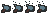<br>Axe (tool 1) | 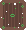<br>Plank (tool 2) — walls off zombies | 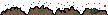<br>Hidden bomb, buried in the dirt |
| 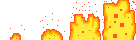<br>Boom | 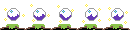<br>Orb — chop 3x for a surprise | 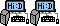<br>Computer — chop 3x to open the recruiter site | 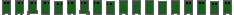<br>Zombie horde (A\* pathing) |
| 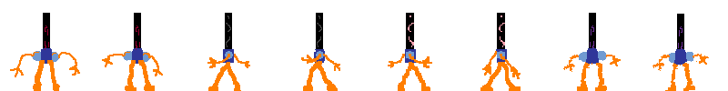<br>Bobot, the frenzy boss | 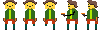<br>Cowboy — stalks in from the left | 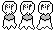<br>Ghost — another player, live | |

## Hidden in the world

Chompixel doubles as its creator's portfolio, woven into the level as things you unlock. Chop the
**OHS** schoolhouse to reach 6 archived projects:

<p>
  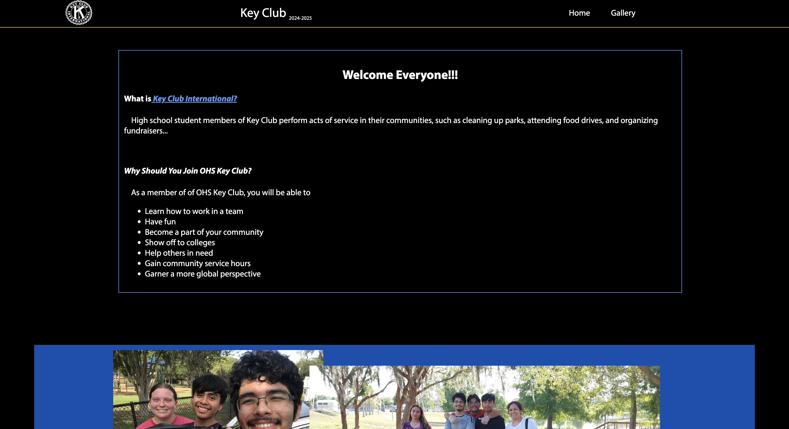
  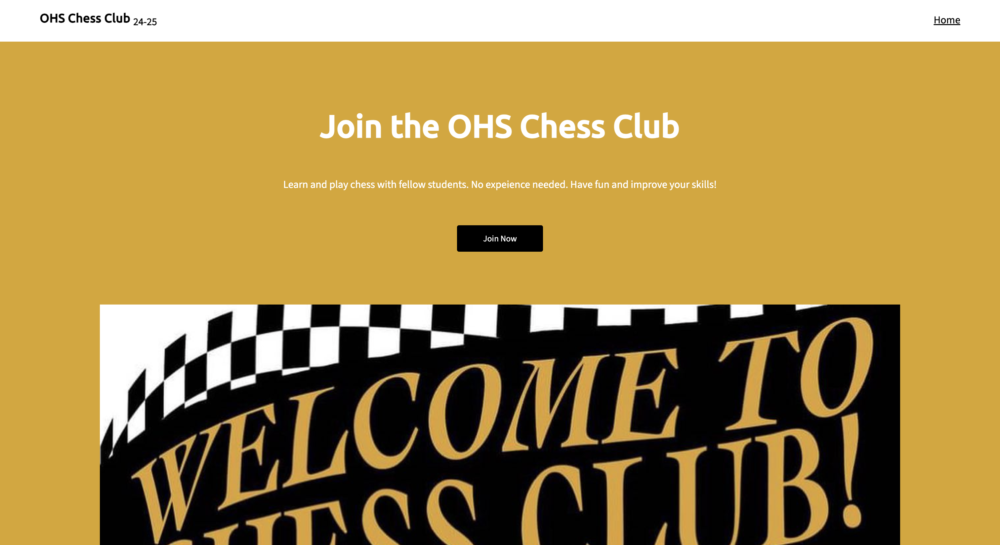
  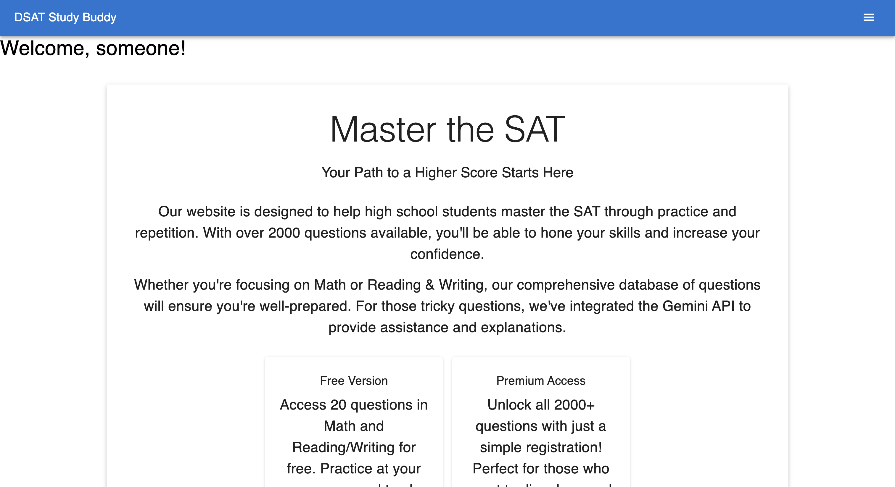
  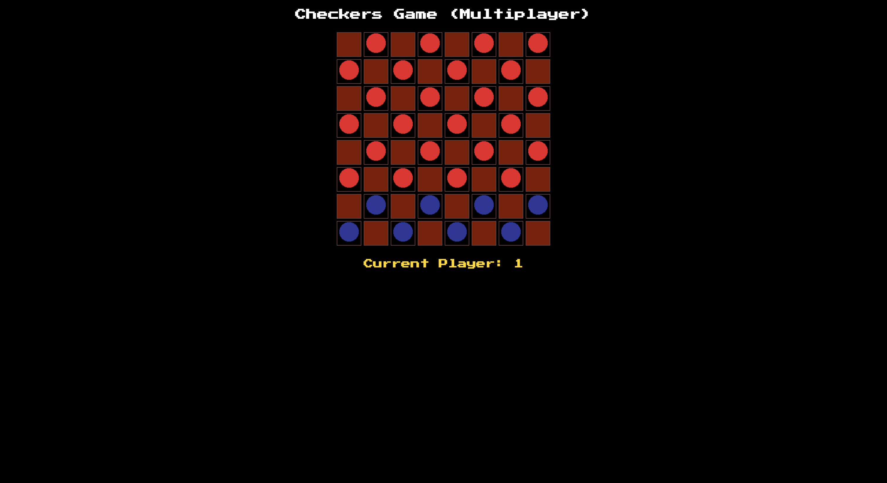
  
  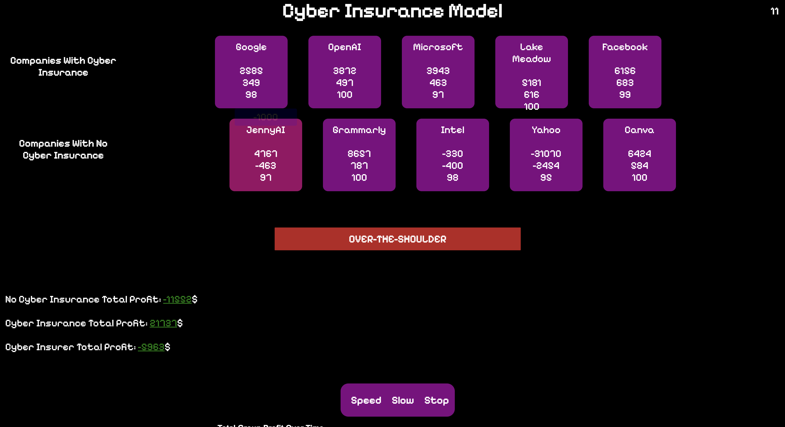
</p>

Chop the **Brown** schoolhouse to reach 3 current projects:

<p>
  
  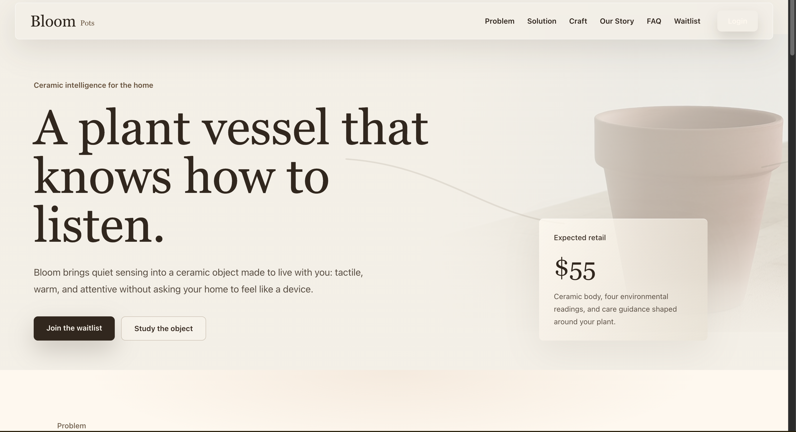
  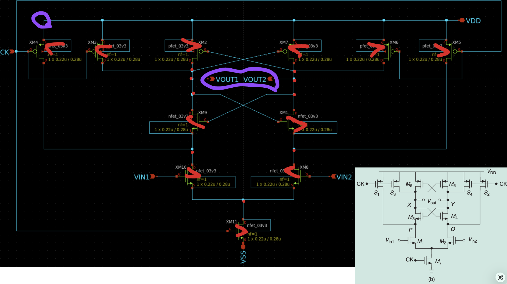
</p>

## Run it locally

No build step, no bundler.

```
python3 -m http.server 8731      # from repo root
```

- Game: `http://localhost:8731/index.html`
- Recruiter site (standalone): `http://localhost:8731/personalWebsite/index.html`

The multiplayer ghosts need the presence server running separately — see
[CONTRIBUTING.md](CONTRIBUTING.md).

## Project layout

- **`index.html` + `src/`** — the game. Plain ES modules + [Phaser](https://phaser.io/) from a CDN.
  - `src/game.js` — Phaser config/bootstrap
  - `src/scenes/IntroScene.js` — the front door / visitor routing
  - `src/scenes/MainScene.js` — the 2D field: chopping, combat, hearts/bombs, sub-world swaps
  - `src/utils/DoomView.js` — the first-person raycaster overlay (the `2D ⇄ 3D` toggle)
  - `src/utils/SoundManager.js`, `src/utils/helpers.js` — audio + shared helpers
  - `src/config/` — game + network config
- **`personalWebsite/`** — a standalone recruiter-facing version of the portfolio (plain HTML/CSS/JS).
- **`assets/`** — sprites, screenshots, and project previews.
- **`server/`** — the multiplayer presence server: a minimal WebSocket relay (Node + `ws`) that
  broadcasts player positions so others render as non-interactive ghosts. Anonymous, in-memory, no auth.

## Contributing

New enemies, weapons, sub-worlds, translations, polish — welcome. Grab a
[`good first issue`](https://github.com/brubru6707/bruno-rodriguez-mendez/issues), and see
[CONTRIBUTING.md](CONTRIBUTING.md) for how to run things and what to check before a PR.

## License

[MIT](LICENSE) — do what you want, just keep the notice.

---

<sub>Built by <a href="https://bruno-rodriguez-mendez.com">Bruno Rodriguez-Mendez</a>. Chompixel is
also his portfolio — the game came first.</sub>
</content>
